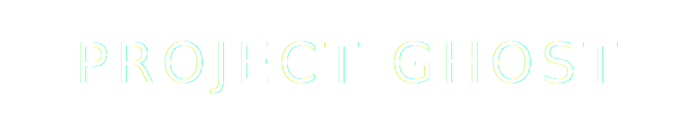

<div align="center">
  
</div>


<br />


### The Agera Chronicles

> “True power never needs to announce itself. It simply exists.”

Project Ghost is a cinematic WebGL experience focused on the visual and mechanical presence of the Koenigsegg Agera. Built with React Three Fiber, the project presents a silver Agera suspended in deep space, using controlled camera motion and reflective materials to highlight form, surface detail, and aerodynamic design.

The experience functions as a visual demo page rather than a traditional application, with each camera movement revealing a specific component of the vehicle alongside contextual information.

---

## Concept

Project Ghost explores mechanical precision in isolation.  
By removing environmental distractions such as tracks or roads, attention is directed entirely toward silhouette, reflection, and material behavior.

The presentation follows a scroll-driven cinematic structure inspired by automotive visual edits, where motion is deliberate and minimal.

---

## Features

- Scroll-driven camera choreography across multiple keyframes
- Physically based rendering with reflective metallic paint and carbon fiber materials
- Deep-space environment designed to enhance contrast and reflections
- AI-powered informational interface using the Gemini API
- Optional free-look camera offset for subtle user interaction
- Responsive layout for desktop and mobile devices

---

## Tech Stack

- React, TypeScript, Tailwind CSS  
- Three.js via @react-three/fiber  
- @react-three/drei  
- Framer Motion  
- Post-processing effects (bloom, noise, vignette)  
- Google Gemini API  

---

## Getting Started

### Prerequisites
- Node.js (v18 or newer)
- Google Gemini API key

### Run Locally

Clone the repository:

```bash
git clone https://github.com/yourname/project-ghost.git
cd project-ghost
Install dependencies:

npm install
Create a .env.local file in the project root:

API_KEY=your_gemini_api_key_here
Run the development server:

npm run dev
